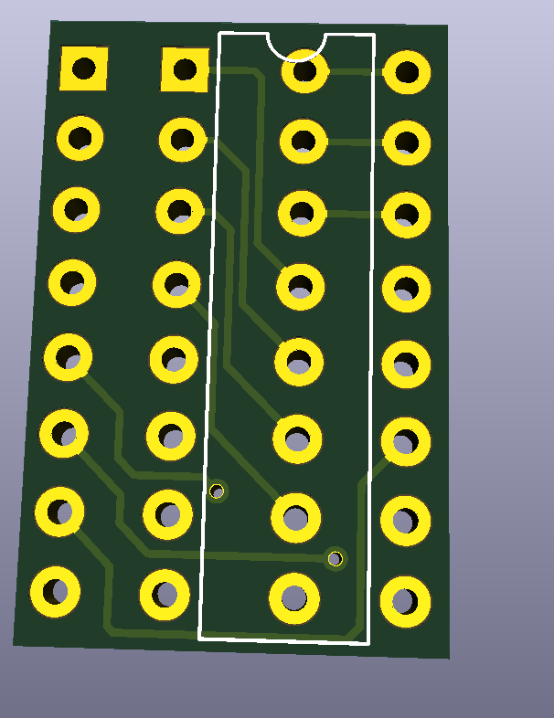
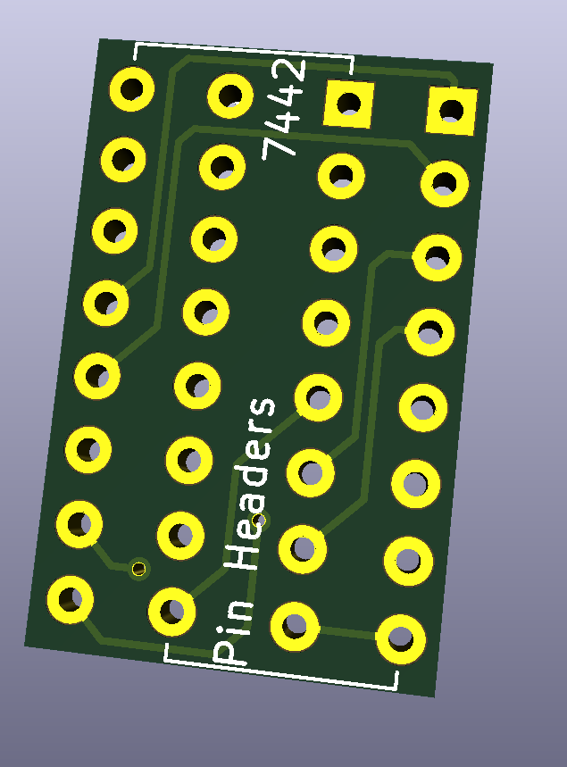

# 7442 to 9301 Decoder Adapter
The purpose of the board is to adapt a 7442 decoder to a now obselete 9301 decoder IC. Ignore the fact that the file name is backwards, it is MEANT to adapt a 7442 to a 9301.  

  
  